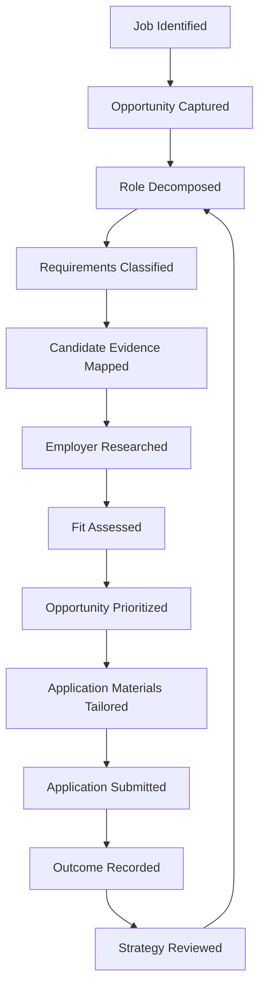

# Hiring Intelligence Project: Methodology and Emerging Case Study

### A documented framework for evaluating role alignment, evidence strength, and application priority during a career transition into AI-supported knowledge work

**Status:** Operational methodology documented; historical evidence consolidation in progress.
**Validation:** Founder-designed personal workflow; operational history and external transferability not yet validated.

**Evidence labels used throughout this document**

| Label | Meaning |
|---|---|
| **[V]** | Verified by an inspectable artifact or record, including the documented architecture contained in this case study |
| **[I]** | Interpretation reasonably supported by available context, not independently verified |
| **[S]** | Self-reported by the operator, not yet corroborated by a saved artifact |
| **[G]** | Gap — proposed component, future metric, or unvalidated claim |

---

## Executive Summary

Job searching, treated as an unstructured activity, produces a familiar failure mode: high application volume with low decision quality. Roles get selected by title rather than requirement, resumes stay generic across dissimilar postings, and time gets spent on low-probability opportunities — while the reasoning behind each decision goes uncaptured, so nothing is learned from what didn't work.

Hiring Intelligence is a methodology developed to address that failure mode during a career transition toward AI strategy, knowledge operations, and decision-intelligence roles. It treats each employment opportunity as a claim requiring evidence: does documented experience actually support a role's requirements, or does the fit depend on interpretation or optimism. The same evidentiary standard applies to employer research, application prioritization, and outcome tracking.

**[I] The operator has performed role analysis, resume tailoring, employer research, and application assessment during this career transition.** This is a reasonable inference from the surrounding context of the project, but no consolidated tracker, dated file set, or application log has yet been assembled to verify how many times, in what form, or with what consistency.

**What this document establishes [V]:** an eight-layer analytical architecture, a defined prioritization logic (Priority A/B/C/Do Not Apply), a decision-logic model separating gating criteria from weighted scoring, and a governance framework separating AI-supported synthesis from human approval authority. These are documented here and can be inspected directly.

**What this document does not yet establish [G]:** that the method was applied repeatedly and consistently to real opportunities, that it produced measurably different outcomes than an unstructured approach, or that it has been used by anyone beyond the operator. Closing that gap requires the artifacts listed in the Artifact Inventory and Evidence Request Ledger below — not further description of the method itself.

---

## Project Snapshot

| Field | Detail |
|---|---|
| Project type | Documented personal decision-support methodology, AI-assisted |
| Domain | Career transition / job-search decision analysis |
| Operator role | Sole designer and decision-maker |
| Primary users | Intended primary user: Operator; no external users documented |
| Core problem | Unstructured job search produced inconsistent decisions with no learning loop |
| Inputs | Job descriptions, resume material, employer information |
| Outputs | Role decomposition structure, evidence-mapping method, prioritization logic |
| Current status | Methodology documented; historical evidence consolidation in progress |
| Validation status | Not externally validated; no consolidated outcome dataset available |

---

## The Problem

An unstructured job search fails in identifiable ways, independent of effort level:

- Applying by title rather than requirement, which obscures whether tools, seniority, or domain knowledge actually align
- Treating all opportunities as equally valuable, so a strong-fit role and a speculative long-shot consume equal time
- Not separating required from preferred qualifications, causing self-disqualification or over-investment
- Using a generic resume across structurally different roles
- Under-representing transferable evidence — military leadership, operational communications, independent research — when it doesn't match the target industry's vocabulary
- Spending time on low-probability roles absent a prioritization logic
- Tracking application activity without capturing the reasoning behind each decision, so misjudgments repeat
- Confusing volume of activity with quality of decisions

This describes the project's own operating problem, not a claim about the broader labor market.

## Design Objective

The objective was not to automate hiring decisions or predict employer behavior. It was a repeatable framework for understanding what a role actually requires, assessing candidate-role alignment against evidence, translating prior experience into verifiable terms, prioritizing applications by expected value, and preserving the reasoning behind each decision so it can be reviewed and eventually measured against outcomes.

---

## System Architecture

Eight layers, each with a defined input, transformation, and output.

**Layer 1 — Opportunity Intake.** Captures a role as a discrete unit before analysis begins: job description, employer site, location/work model, compensation where available, seniority, visa or residency constraints, deadline, recruiter contact.

**Layer 2 — Role Decomposition.** Separates core responsibilities, required qualifications, preferred qualifications, tools/technical requirements, leadership expectations, domain knowledge, implied seniority, unstated operational expectations, and potential disqualifiers.

**Layer 3 — Candidate Evidence Mapping.** Maps each requirement to direct evidence, transferable evidence, a supporting project, its resume location, an assessed strength rating, an identified gap, and proposed positioning language.

**Layer 4 — Employer and Market Research.** Assesses employer legitimacy, business model, organizational maturity, hiring signals, strategic fit, geographic feasibility, and identifiable risks.

**Layer 5 — Fit Assessment.** Separates capability fit, evidence fit, experience fit, seniority fit, domain fit, location fit, compensation fit, career-direction fit, and application-effort fit, so strength in one dimension cannot mask weakness in another.

**Layer 6 — Prioritization.** Classifies opportunities:

- **Priority A** — strong evidence and strategic fit
- **Priority B** — credible fit with manageable, addressable gaps
- **Priority C** — exploratory or low-probability application
- **Do Not Apply** — material disqualifier or poor strategic value

*[I] This is the formalized version of a judgment process the operator was applying informally. Presented as the intended operating structure, not as a scheme proven applied identically across every opportunity to date.*

**Layer 7 — Application Production.** Uses Layers 2–6 to inform resume selection and tailoring, summary positioning, keyword alignment, cover-letter emphasis, and interview preparation.

**Layer 8 — Outcome Learning.** Intended to track applications submitted, responses, interviews, rejections, time per application, response rate by category, resume version, and evidence gaps.

**[G] Outcome data has not yet been consolidated into a structured dataset.** This layer describes intended measurement structure, not measured results.

---

## Decision Logic

The model deliberately avoids collapsing a hiring decision into a single number, since a composite score can hide a disqualifying constraint (e.g., an unmet visa requirement) behind a strong average. It combines gating criteria, weighted dimensions, written rationale, an explicit confidence level, and final human judgment.

**Illustrative scoring framework (0–5 scale)** — weights and thresholds below are illustrative and not calibrated against outcome data:

| Dimension | Basis |
|---|---|
| Role alignment | Match between core responsibilities and demonstrated experience |
| Evidence strength | Proportion of requirements supported by direct evidence |
| Transferable-skill strength | Credibility of the translation from prior experience |
| Employer attractiveness | Stability, mission fit, and Layer 4 findings |
| Geographic feasibility | Location, relocation, remote/hybrid, visa constraints |
| Compensation alignment | Fit with disclosed or estimated range |
| Career-direction alignment | Fit with target trajectory |
| Application effort | Time/material cost relative to expected value |
| Strategic portfolio value | Whether pursuing the role builds useful evidence regardless of outcome |

A high total score does not override a gating disqualifier: a role scoring well everywhere except an unmet hard requirement is still routed to Do Not Apply.

---

## Evidence-Mapping Framework (Illustrative)

*Constructed from the operator's documented background — not a record of a specific completed application.*

| Role Requirement | Type | Candidate Evidence | Evidence Type | Strength | Gap | Application Implication |
|---|---|---|---|---|---|---|
| Cross-functional communications leadership | Required | USMC operational communications and team leadership | Direct | Strong | None material | Lead with in summary and first bullet |
| AI-assisted research workflow experience | Preferred | Multi-platform AI archive analysis, evidence-governed reporting | Direct | Strong | Not employer-validated | Frame as independently built system |
| Formal data-analytics credential | Preferred | Accepted into MSIT Data Analytics program (start pending) | Transferable/forthcoming | Moderate | Not yet completed | Note as in-progress; do not imply completion |
| Training and instruction of teams | Required | USMC instructional and supervisory roles | Direct | Strong | None material | Map directly to posting's "enablement" language |
| Named enterprise BI tool | Required | General data-analysis tool use (Python, structured evidence work) | Transferable | Weak–Moderate | No documented use of the specific tool | Flag as gap; consider Priority B if hard requirement |
| Independent project ownership | Preferred | Independent forensic-analysis and publishing project, sole-operator | Direct | Strong | Single-operator; not team-validated | Position as initiative and system-building evidence |

---

## Illustrative Opportunity Assessments

*The three examples below correspond to the role families named in the operator's target profile — AI Workflow Specialist, Knowledge Operations/AI Adoption, and Business Operations/Operational Excellence. **None is drawn from a saved application record**; each is constructed to show how the layers combine, and each would need to be replaced with a real assessment (per the Artifact Inventory below) before being cited as evidence of repeated use.*

### 1. AI Workflow Specialist

- **Requirements:** Designing structured AI-assisted workflows; translating ambiguous requests into repeatable process; documentation discipline; stakeholder communication.
- **Strongest alignment:** Workflow design and documentation discipline (direct); communication/training background (direct, transferable framing).
- **Material gap:** No documented enterprise-team deployment at scale — experience is single-operator to date.
- **Priority:** B — credible fit; scale gap addressed directly in cover letter rather than concealed.
- **Confidence:** Moderate, pending employer research on team structure and tooling.

### 2. Knowledge Operations / AI Adoption Role

- **Requirements:** Structuring organizational knowledge; supporting AI-tool rollout; change communication; documentation standards.
- **Strongest alignment:** Evidence-governance methodology and structured documentation practice (direct); instructional/training background applied to adoption/change-communication requirements (transferable).
- **Material gap:** No record of leading adoption inside a multi-person organization; work to date is self-directed.
- **Priority:** B — strong methodological fit; organizational-scale evidence is the open item.
- **Confidence:** Moderate.

### 3. Business Operations / Operational Excellence Role

- **Requirements:** Process improvement; cross-team coordination; performance measurement; operational documentation.
- **Strongest alignment:** USMC operational leadership and coordination (direct); performance-measurement framework design demonstrated in this project itself (direct, though self-directed).
- **Material gap:** No documented civilian-sector operations role; translation from military to civilian operational vocabulary required throughout.
- **Priority:** B — strong raw capability; positioning work required to bridge vocabulary gap.
- **Confidence:** Moderate.

---

## Artifact Inventory

The table below lists the specific saved artifacts that would convert each layer of the method from "designed" to "demonstrated." None are confirmed as currently consolidated; this is the checklist for closing that gap.

| Artifact | Evidence It Would Demonstrate | Status |
|---|---|---|
| Job-description analysis (populated) | Requirement decomposition actually performed | Not confirmed as saved |
| Tailored resume version, per role | Evidence-to-role alignment in practice | Not confirmed as saved |
| Employer research brief | Research synthesis actually performed | Not confirmed as saved |
| Apply/decline recommendation with rationale | Decision support in practice | Not confirmed as saved |
| Application tracker | Workflow operation over time | Not confirmed as saved |
| Weekly or recurring job scan | Repeatability of the method | Not confirmed as saved |
| Outcome record (response, interview, rejection) | Performance measurement | Not confirmed as saved |

---

## Human-AI Workflow

**AI functions:** job-description parsing and requirement extraction, requirement classification, keyword extraction, draft comparison between resume and posting, employer-research synthesis, draft scoring, evidence-gap identification, tailoring suggestions, reporting support once outcome data exists.

**Human responsibilities:** determining career direction, verifying cited evidence, deciding whether a transferable-skill claim is credible, assessing personal constraints, reviewing employer risk, approving every specific claim, rejecting overstated AI-suggested language, and making the final apply-or-decline decision.

**Governing principle: AI can organize the evidence. It cannot authorize an unsupported claim.**

---

## Workflow and Data Flow

Job identified → opportunity captured → role decomposed → requirements classified → candidate evidence mapped → employer researched → fit assessed → opportunity prioritized → application materials tailored → application submitted → outcome recorded → strategy reviewed

---

## Performance Measurement Model (Proposed)

Four levels, none yet populated with data: **Activity** (roles reviewed, applications submitted, time spent), **Process Quality** (percentage of requirements evidence-mapped, percentage of applications tailored), **Market Response** (recruiter responses, interviews, response rate by priority class), **Strategic Learning** (repeated skill gaps, best-performing positioning themes, most responsive role families).

**[G] No results are claimed at any of the four levels.** This is the intended measurement structure; the Artifact Inventory above lists what is needed to populate it.

---

## Governance and Ethical Boundaries

Every resume claim traces to evidence identified in Layer 3; transferable-skill framing is labeled as interpretation, not presented as direct experience. A single-operator scoring process has no independent check, so scores should be read as structured judgment, not a validated instrument. Keyword alignment supports but does not replace evidence mapping. Employer research is directional, drawn from public sources, not confirmed insider information. Compensation and hiring-signal assessments are explicitly probabilistic. Every AI-drafted claim requires human review before use.

**Governing principle: a structured assessment can improve consistency without making an uncertain hiring process predictable.**

---

## Results and Current Evidence

**Established [V]:** the eight-layer architecture, the prioritization logic, and the decision-logic model separating gating criteria from weighted scoring are documented and can be inspected directly in this document.

**Reasonably inferred, not independently verified [I]/[S]:** that the operator has applied elements of this reasoning to real opportunities during the current career transition; that AI-assisted synthesis supported research and drafting in at least some of those cases.

**Not yet established [G]:** causal improvement in hiring outcomes relative to an unstructured approach; external transferability beyond the operator; recruiter or hiring-manager acceptance; reduced time per successful application; predictive validity of the scoring model; freedom from single-operator scoring bias.

---

## Limitations

Single-operator use to date, with no inter-rater validation. Outcome data (Layer 8) has not been consolidated. Labor-market conditions are not controlled for. Employer decision processes are not observable from the candidate side. Role descriptions may not reflect actual responsibilities. Transferable-skill mapping is inherently subjective, particularly translating military experience into civilian technical roles. Any future application sample will likely be small. Visa, residency, and geographic constraints affect viability independent of fit score. AI-assisted parsing can introduce interpretation errors requiring human review. No external validation of the scoring framework exists.

---

## Transferable Value

The underlying capabilities — requirement decomposition, evidence mapping, structured prioritization, evidence-governed documentation — apply beyond a personal job search: recruiting operations and talent intelligence, workforce planning, career services, internal mobility, competency architecture, learning-and-development design, and decision-support system design generally. **[G] No professional recruiting experience is claimed** — this describes capability transfer, not domain experience in talent acquisition.

---

## Future Development

**Phase 1 — Evidence Consolidation:** gather historical role assessments, standardize application records, reconstruct decision rationales, establish a baseline. **Phase 2 — Formalization:** reusable templates per layer, explicit scoring rules, version control. **Phase 3 — Measurement:** track outcomes by role family and priority, measure response rates. **Phase 4 — External Pilot:** test with a small number of external users, predefine outcomes, report mixed results honestly. **Phase 5 — Validation:** assess inter-reviewer consistency, predictive usefulness, usability, and bias.

---

## Conclusion

Hiring Intelligence reframes job searching as an evidence and decision problem rather than a volume problem. Its demonstrated value, to date, is the architecture itself: a repeatable structure for decomposing roles, mapping evidence, and separating human judgment from AI-assisted synthesis. What it does not yet demonstrate is that this structure changes outcomes, or that it has operated consistently across a real, trackable set of opportunities. The next step is not further design work — it is assembling the artifacts in the inventory above, so the method's actual track record, not just its architecture, can be evaluated.

---

## Portfolio Summary

**Portfolio Classification**

> **Hiring Intelligence Project**
> **Methodology and Emerging Case Study**
>
> A documented decision-support architecture for role analysis, candidate-evidence mapping, employer research, and application prioritization. Historical application records and outcome data are being consolidated for operational validation.

**50-Word Version**

Hiring Intelligence is a documented, evidence-governed methodology for evaluating employment opportunities: decomposing roles, mapping candidate evidence to requirements, and prioritizing applications by fit rather than convenience. The architecture and decision logic are documented. Historical application evidence is being consolidated to validate the method's actual track record.

**100-Word Version**

Hiring Intelligence is a methodology for converting an unstructured job search into an evidence-governed decision process, developed during a transition into AI strategy and knowledge-operations roles. It decomposes job postings into requirements, maps each to direct or transferable candidate evidence, researches employer fit, and classifies opportunities using a defined priority system rather than applying uniformly. AI supports parsing, research synthesis, and drafting; the operator retains sole approval authority over every fit claim. The eight-layer architecture, decision logic, and governance model are fully documented. A consolidated record of applications, outcomes, and response data has not yet been assembled.

**Resume Version**

- Developed a structured methodology for decomposing job requirements and mapping them to direct, transferable, and missing candidate evidence.
- Formalized a multidimensional opportunity-assessment model covering capability, seniority, geography, employer fit, and application effort.
- Established human-review controls for AI-assisted role research, resume alignment, and application recommendations.

**LinkedIn Project Description (≤500 characters)**

Hiring Intelligence is a documented, evidence-governed methodology for evaluating job opportunities during a career transition into AI strategy and knowledge operations. It decomposes role requirements, maps them to candidate evidence, researches employer fit, and prioritizes applications using a defined scoring and gating framework. AI supports research and drafting; human judgment approves every claim. Architecture and decision logic are documented; historical application evidence is currently being consolidated. (403 characters)

**GitHub Description (≤350 characters)**

A documented, evidence-governed methodology for evaluating job opportunities: role decomposition, candidate-evidence mapping, employer research, and a defined prioritization model (Priority A–C / Do Not Apply). Records the reasoning behind each decision. Architecture and decision logic are documented; historical application dataset in progress. (277 characters)

**Skills**

Decision Intelligence · Evidence-Based Analysis · Competency Mapping · Research Synthesis · Workflow Design · Requirements Analysis · Human-AI Collaboration · Knowledge Architecture · Data Governance · Documentation Systems · Strategic Prioritization · Career Transition Strategy · Process Optimization

---

## Evidence Request Ledger

| Evidence Needed | Why It Matters | Ideal Source | Status | Claim It Would Support |
|---|---|---|---|---|
| Number of roles analyzed | Establishes scale of method application | Personal tracking records | Not available | "Applied to N roles" |
| Number of applications submitted | Baseline for any response-rate metric | Application log | Not available | Market-response claims |
| Populated analysis templates | Converts described method into demonstrated artifacts | Operator's working files | Not confirmed as consolidated | "Method was used, not just designed" |
| Scoring records | Tests whether the framework was applied consistently | Populated scoring sheets | Not available | Consistency claims |
| Resume versions used, dated | Enables tailored-vs-generic comparison | File history | Not confirmed as consolidated | "Materials were tailored per opportunity" |
| Employer research briefs | Demonstrates Layer 4 execution | Operator's notes | Not available | Employer-research claim |
| Application outcomes | Core input for any hiring-outcome claim | Email/tracking records | Not available | Any outcome claim |
| Interview invitations | Strongest available external-validation proxy | Email/calendar records | Not available | "Method correlates with interview interest" |
| Time-per-application data | Tests efficiency hypothesis | Time tracking, if any | Not available | Efficiency claim |
| File dates on templates/trackers | Establishes actual development timeline | File metadata | Not available | Chronology claims |
| External user feedback | Only source of validation beyond self-assessment | Future pilot participants | Not applicable — Phase 4 not started | External-validation claim |

---

## Claim Audit Summary (Revised)

This revision corrects the following from the prior draft, per direct audit:

- Removed all **[V]** labels applied to statements about the method having been "applied," "used in active operation," or "used" — these are now labeled **[I]** or **[S]** and explicitly flagged as not independently verified.
- Removed the "publication-ready" characterization from the final audit; replaced with the two-tier status used at the top of this document.
- Replaced the three original resume bullets, which implied a completed operational track record, with the safer wording above, scoped to methodology design and governance rather than repeated field use.
- Added the evidence-label legend at the top so every downstream label is interpretable without cross-referencing this section.
- Added the Artifact Inventory table distinguishing what is designed from what is demonstrated.
- Replaced the single illustrative example with three illustrative examples matched to the operator's stated target role families, each explicitly marked as constructed rather than drawn from a saved record.
- Trimmed repeated evidence-gap warnings that appeared in multiple sections of the prior draft (Results, Outputs, Performance Measurement, and the original Claim Audit) into single statements per section.

**Net assessment:** this version is defensible as a methodology and framework case study. It should still not be cited as evidence of measured hiring outcomes, repeated field validation, or external use — those claims remain gated behind the Artifact Inventory and Evidence Request Ledger.

### Round-two corrections (this revision)

- **[V] definition corrected.** The legend previously restricted [V] to artifacts external to this document, while the Executive Summary labeled the architecture [V] on the basis of internal inspection — a direct contradiction. The definition now explicitly includes the documented architecture contained in this case study as a valid [V] basis, so the label and its use are consistent.
- **"Complete" removed from both public summaries.** The LinkedIn and GitHub descriptions previously said the architecture was "complete," which overstates a framework the Future Development section itself describes as unformalized and uncalibrated. Both now read "documented" instead.
- **Single-user claim qualified.** "Operator (single-user to date)" and "Founder-operated personal workflow" both implied a verified operational history. Both are replaced with wording that states the operator as the intended primary user and the workflow as founder-*designed*, without asserting a track record of repeated use that hasn't been independently confirmed.
