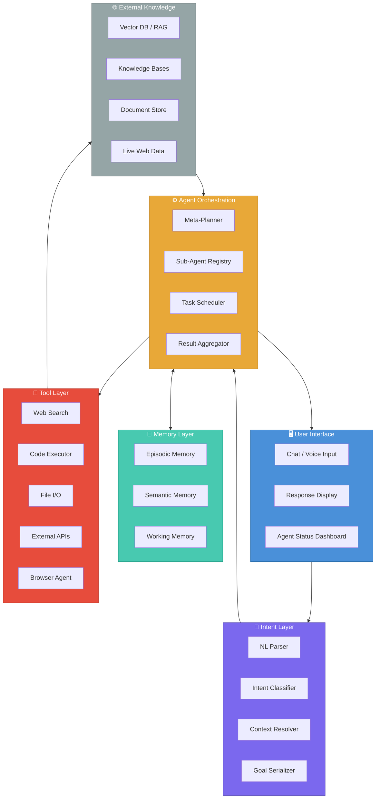

# PAIOS Visual Architecture Diagram

**Personal AI Operating System — Layered Architecture**

Author: Sheldon Howard  
Date: March 2026

---

## Layer Explanations

### 1. User Interface
The outermost layer through which humans interact with the system. It accepts natural-language input (text, voice, or multimodal), displays AI-generated responses and visualizations, and surfaces agent status, memory snapshots, and tool outputs. Designed for minimal friction: the user speaks intent, not instructions.

### 2. Intent Layer
Acts as the semantic parser and goal-formation engine. Raw user input is transformed into structured intent objects — goals, constraints, priority signals, and context tags. This layer handles ambiguity resolution, intent chaining (multi-step goals), and passes a clean task specification downstream to the orchestration layer. It is the boundary between human language and machine logic.

### 3. Agent Orchestration
The operating kernel of PAIOS. A meta-agent (or planner) decomposes intent objects into subtasks, selects specialized sub-agents (research agent, writing agent, code agent, scheduler, etc.), sequences their execution, and aggregates their outputs. Manages concurrency, error recovery, and feedback loops between agents. Equivalent to a process scheduler in a traditional OS.

### 4. Memory Layer
Provides persistent and working memory across sessions. Composed of three memory stores:
- **Episodic memory** — timestamped records of past interactions and outcomes
- **Semantic memory** — structured knowledge extracted from interactions and documents
- **Working memory** — short-lived context for the current task window

Agents read and write to this layer; it ensures continuity, personalization, and learning over time.

### 5. Tool Layer
Exposes a registry of callable tools and APIs that agents invoke to act on the world. Includes web search, code execution, file I/O, calendar and email APIs, browser automation, data analysis tools, and third-party service integrations. Each tool has a defined input/output schema. The Tool Layer is the effector system of PAIOS — the hands of the AI.

### 6. External Knowledge
The grounding layer that connects PAIOS to structured and unstructured knowledge outside the system boundary. Includes vector databases for semantic retrieval (RAG), curated knowledge bases, domain ontologies, live web data, and user-owned document stores. Provides factual grounding to prevent hallucination and expands the system's epistemic reach beyond its trained parameters.

---

## Diagram Structure

```
┌──────────────────────────────────────────────────┐
│                 USER INTERFACE                   │  ← Human input / output
├──────────────────────────────────────────────────┤
│                  INTENT LAYER                    │  ← Parse & structure goals
├──────────────────────────────────────────────────┤
│             AGENT ORCHESTRATION                  │  ← Plan, route, coordinate
├────────────────────────┬─────────────────────────┤
│      MEMORY LAYER      │       TOOL LAYER        │  ← Persist & act
├────────────────────────┴─────────────────────────┤
│               EXTERNAL KNOWLEDGE                 │  ← Retrieve & ground
└──────────────────────────────────────────────────┘
```

**Data flow:**  
User Input → Intent Layer → Agent Orchestration → (Memory Layer ↔ Tool Layer) → External Knowledge  
Results bubble back up through the same path to the User Interface.

---

## Labels

| Layer | Role Label | Key Components |
|---|---|---|
| User Interface | Human–AI Gateway | Chat UI, Voice Input, Dashboard, Notifications |
| Intent Layer | Goal Parser | NL Parser, Intent Classifier, Context Resolver, Goal Serializer |
| Agent Orchestration | AI Kernel | Meta-Planner, Sub-Agent Registry, Task Scheduler, Result Aggregator |
| Memory Layer | Cognitive Store | Episodic DB, Semantic Store, Working Memory Buffer |
| Tool Layer | Effector System | Web Search, Code Runner, File I/O, APIs, Browser Agent |
| External Knowledge | Epistemic Foundation | Vector DB (RAG), Knowledge Bases, Web Index, Document Store |

---

## Recommended Visualization Style

- **Layout:** Top-down layered block diagram (horizontal bands)
- **Color palette:**
  - User Interface — `#4A90D9` (calm blue, human-facing)
  - Intent Layer — `#7B68EE` (medium slate purple, cognitive)
  - Agent Orchestration — `#E8A838` (amber, active processing)
  - Memory Layer — `#48C9B0` (teal, persistence)
  - Tool Layer — `#E74C3C` (red-orange, action/effectors)
  - External Knowledge — `#95A5A6` (muted grey, grounding foundation)
- **Typography:** Sans-serif, bold layer labels, regular sublabels
- **Arrows:** Bidirectional between adjacent layers; dashed for async/background interactions (e.g., Memory ↔ Orchestration)
- **Icons:** Use system-metaphor icons (brain for memory, wrench for tools, globe for external knowledge, user silhouette for UI)
- **Format:** SVG or rendered Mermaid in Markdown; export as PNG for embedding in papers

---

## Mermaid Diagram Code



---

## Interaction Flows

### Flow 1 — Query & Respond
```
User → UI → Intent Layer (parse) → Agent Orchestration (plan)
    → Tool Layer (web search) → External Knowledge (RAG lookup)
    → Agent Orchestration (aggregate) → UI (display answer)
```

### Flow 2 — Long-Running Task
```
User → UI → Intent Layer (decompose multi-step goal)
    → Agent Orchestration (schedule sub-agents)
    → Memory Layer (load context) + Tool Layer (code exec, APIs)
    → Memory Layer (persist result) → UI (notify completion)
```

### Flow 3 — Memory-Driven Personalization
```
Agent Orchestration → Memory Layer (retrieve episodic + semantic)
    → Intent Layer (enrich context) → Agent Orchestration (adapted plan)
```
